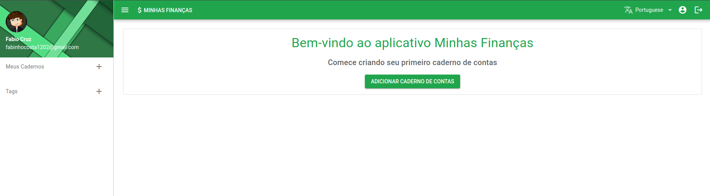

# API Faccount

Faccount é uma aplicação web para gestão financeira pessoal. Permite aos usuários registrar suas despesas e receitas, categorizá-las e gerar relatórios para ajudar na análise e controle financeiro.

Este repositório é API REST do projeto FAccount, para acessar o código
fonte do frontend acesse [Faccount Frontend](https://github.com/fabinhoc/my-finance-web).



## Funcionalidades

- **Registro de Despesas:** Os usuários podem adicionar transações financeiras, incluindo informações como valor, data e descrição.
- **Categorização:** As transações podem ser categorizadas para uma melhor organização e análise.
- **Autenticação de Usuário:** A aplicação oferece autenticação de usuário para proteger as informações financeiras.

## Tecnologias Utilizadas

- **Frontend:** Acesse [Faccount Frontend](https://github.com/fabinhoc/my-finance-web)
- **Backend:** PHP 8.3 e Laravel 10
- **Banco de Dados:** MYSQL ou Postgress.
- **Autenticação:** JWT (JSON Web Tokens).
- **Outras Ferramentas:** Laravel Sail, Laravel Sanctum.

## Instalação e Uso

1. **Clone o Repositório:**
   ```bash
   git clone https://github.com/fabinhoc/faccount.git
   ```

1. **Acessar pasta do projeto:**
    ```bash
   cd faacount
   ```

3. **Instale as Dependências:**
   ```bash
    docker run --rm \
    -u "$(id -u):$(id -g)" \
    -v "$(pwd):/var/www/html" \
    -w /var/www/html \
    laravelsail/php82-composer:latest \
    composer install --ignore-platform-reqs
   ```

3. **Configuração do Banco de Dados:**
   - Configure seu banco de dados e atualize as credenciais no arquivo `.env`.

4. **Acesse a Aplicação:**
   - Abra seu navegador e vá para `http://localhost` para acessar a aplicação.

## Contribuição

Contribuições são bem-vindas! Sinta-se à vontade para abrir uma issue ou enviar um pull request para melhorar este projeto.

## Licença

Este projeto está licenciado sob a [Licença MIT](LICENSE). Consulte o arquivo LICENSE para obter mais detalhes.

## Contato

Para mais informações, entre em contato com Fabio Cruz em fabinhocosta1202@gmail.com.
